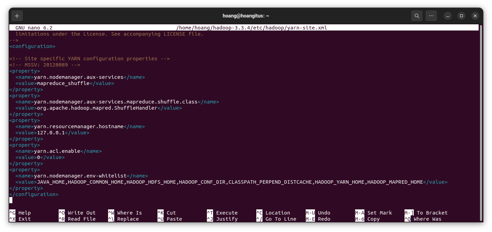

# Lab 01: A Gentle Introduction to Hadoop

## Setting up Single-node Hadoop Cluster

## Introduction to MapReduce


## Running a warm-up problem: Word Count

## Bonus

## TEAM HugeData:
MSSV       | FULLNAME             | TASKS           
-----------|----------------------|-----------
20120560   | Cao Đinh Quí         | 1, 2.1.3, write report           
20120089   | Lê Xuân Hoàng        | 1, 2.1.1, 4                
20120130   | Đinh Thị Hoàng Linh  | 1, 2.1.4, 4               
20120397   | Bùi Quang Tùng       | 1, 2.1.2, 3               

### COMPLETION RATE:
SESSION| RATE                    
-------|--------------------------
1      | 100%       
2      | 100%       
3      | 100%       
4      | 50%       

---------------------------------------------------------------
## 1.  Setting up Single-node Hadoop Cluster
### All members finished successfully.
#### The process:
### **Step 1: Download hadoop-3.3.4.tar.gz**
Download from link: https://www.apache.org/dyn/closer.cgi/hadoop/common/hadoop-3.3.4/hadoop-3.3.4.tar.gz

Then extract to Home.


### **Step 2: Install ssh**
Type:
```
sudo apt get-get install ssh
```
Then check:
```
ssh -V
```

### **Step 3: Install pdsh**
Type:
```
sudo apt-get install pdsh
```
Then check:
```
pdsh -V
```


### **Step 4: Install Java**
Check if your computer has java installed:
```
java --version
```
If Java is already installed, there is no need to reinstall it. But if you want to install Java then type:
```
sudo apt install openjdk-8-jdk -y
```

### **Step 5: Create and Install SSH Certificates**
```
ssh-keygen -t rsa -P '' -f ~/.ssh/id_rsa
```


Save information:
```
cat ~/.ssh/id_rsa.pub >> ~/.ssh/authorized_keys
```


Grant permissions to the user:
```
chmod 0600 ~/.ssh/authorized_keys
```

### **Step 6: Edit bashrc file.**
```
nano ~/.bashrc
```


### **Step 7: Edit hadoop-env.sh file.**
```
nano ~/hadoop-3.3.4/etc/hadoop/hadoop-env.sh
```


### **Step 8: Edit core-site.xml**
Create a tmp transit folder and grant all users access to it.
```
mkdir -p ~/hadoop-3.3.4/tmp
chmode 777 ~/hadoop-3.3.4/tmp
```


Edit core-site.xml:
```
nano ~/hadoop-3.3.4/etc/hadoop/core-site.xml
```


### **Step 9: Edit mapred-site.xml**
```
nano ~/hadoop-3.3.4/etc/hadoop/mapred-site.xml
```

### **Step 10: Edit hdfs-site.xml**
Create two folder namenode and datanode
```
mkdir -p /home/hoang/hadoop-3.3.4/data/namenode
mkdir -p /home/hoang/hadoop-3.3.4/data/datanode
```


Edit hdfs-site.xml
```
nano ~/hadoop-3.3.4/etc/hadoop/hdfs-site.xml
```


### **Step 11: Edit yarn-site.xml**
```
nano ~/hadoop-3.3.4/etc/hadoop/hdfs-site.xml
```




### **Step 12: New Hadoop system file format**
```
hdfs namenode -format
```


### **Step 13: Start nodes**
Run namenode,datanode, secondary namenode:
```
start-dfs.sh
```


Run yarn:

```
start-yarn.sh
```


### **Step 14: Check result.**


### **Result of all members:**

**20120560 - Cao Đình Qúi:**


**20120397 - Bùi Quang Tùng:**


**20120089 - Lê Xuân Hoàng:**


**20120130 - Đinh thị Hoàng Linh:**


_____________________________________________________________
## 2.  Introduction to MapReduce
#### 2.1. How do the input keys-values, the intermediate keys-values, and the output keys-values relate? 
- Input keys-values: The initial data is divided into multiple input keys-values to be fed into MapReduce for processing.
- Intermediate keys-values: Generated from the input keys-values by the Map function. Its key is the result of the Map function's processing, and its value is information to be used in the Reduce function.
- Output keys-values: Generated from intermediate keys-values. The intermediate keys-values are sorted by key and partitioned across reducers. The reducers perform the Reduce function on the groups of intermediate keys-values and generate output keys-values.
- It can be said that input keys-values, intermediate keys-values, and output keys-values are interrelated as the output of one function serves as the input for the next function in the MapReduce process.
#### 2.2 How does MapReduce deal with node failures?
- Redundant storage: MapReduce replicates data across multiple nodes in the cluster to ensure that if one node fails, the data can still be accessed and processed.
- Task tracking: MapReduce tracks completed tasks and tasks that are currently running. If a node fails while running a task, the task can be automatically restarted on another node.
- Job checkpointing: MapReduce periodically stores the intermediate output of a job on disk. If a node fails, the job can be restarted from the last checkpoint instead of starting from scratch, reducing processing time.
- Node monitoring: MapReduce continuously monitors the health of nodes in the cluster through heartbeat. If a node becomes unresponsive or fails, MapReduce can automatically remove it from the cluster and redistribute its tasks to other nodes.
#### 2.3.  What is the meaning and implication of locality? What does it use? 
- The meaning:
    - In MapReduce Hadoop, locality refers to processing data at or near its physical storage location. Locality is an important aspect of the Hadoop MapReduce framework, and it relates to the principle of processing data at or near its physical storage location. By prioritizing locality, Hadoop can reduce network load and improve system performance.
- Use case:
    - Locality aims to reduce the amount of data that needs to be transferred over the network, reduce network load, and improve system performance. Hadoop achieves locality by attempting to schedule tasks on nodes where their input data is stored, which is known as data locality. This is made possible by Hadoop storing data in a distributed manner across a cluster of standard hardware nodes, with each node responsible for processing a portion of the data.
    - When a task is scheduled on a node, the MapReduce framework attempts to read data from the local disk of that node first. Only when the data is not available locally, it is accessed from a remote node. By prioritizing data locality, Hadoop can significantly reduce the amount of data transmitted over the network, which is important for efficiently processing large data sets.
#### 2.4. . Which problem is addressed by introducing a combiner function to the MapReduce model?
- In some cases, the Map tasks return multiple instances of the same <key,value> pair. The Combiner function summarizes these instances into a single <key,value> pair then transfers the result to the Reduce tasks, thus reducing the workload on them and speeding up the whole operation.
_____________________________________________________________
## 3.  Running a warm-up problem: Word Count
#### The process and result: 
- run Hadoop


- Create folder to work


- Environment setting


- Add libary


- Change file to jar


- Copy from local to hadoop


- Complie and run


- Check to see if it is successful


- Result


_____________________________________________________________
## 4.  Bonus
#### 4.1. Extended Word Count: Unhealthy relationships

- Input:
A D
A B
B C
D B
B E
E C
- Output:
A	pos
B	eq
C	neg
D	eq
E	eq
#### 4.2. Setting up Fully Distributed Mode

_____________________________________________________________
## References
#### ref1: [ Example:_WordCount_v1.0 Apache Hadoop 3.3.4 – MapReduce Tutorial](https://hadoop.apache.org/docs/current/hadoop-mapreduce-client/hadoop-mapreduce-client-core/MapReduceTutorial.html)
#### ref2: [  Cài đặt hadoop-3.3.1 Pseudo-distributed mode](https://www.youtube.com/watch?v=MZ_FUEnbrR4)
#### ref2: [ Apache Hadoop 3.3.4 – Hadoop: Setting up a Single Node Cluster.](https://hadoop.apache.org/docs/stable/hadoop-project-dist/hadoop-common/SingleCluster.html )
#### Book: Jeffrey Dean and Sanjay Ghemawat. MapReduce: Simplified Data Processing on Large Clusters.In OSDI’04: Sixth Symposium on Operating System Design and Implementation, pages 137–150, San Francisco, CA, 2004.